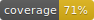

 [](https://travis-ci.org/byverdu/crypto-dashboard) 


# Crypto Dashboard

webApp where you can see your crypto portfolio.

## Install

1. Clone repo

```bash
> git clone https://github.com/byverdu/crypto-dashboard.git
```

2. Run Docker

```bash
> sudo docker-compose up --build
```

3. Visit [http://localhost:3040](http://localhost:3040)

### Docker commands

**The following only builds the images, does not start the containers:**

`docker-compose build`

**The following builds the images if the images *do not exist* and starts the containers:**

`docker-compose up`

**If you add the --build option, it is forced to build the images even when not needed:**

`docker-compose up --build`

**The following skips the image build process:**

`docker-compose up --no-build`

**If the images aren’t built beforehand, it fails. (edited)**

`docker system prune -a --volumes`